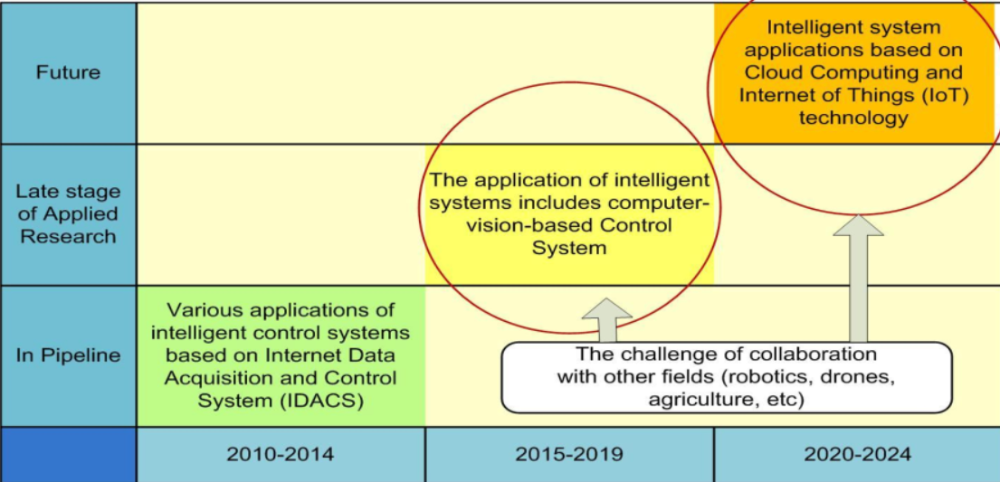

## 📑Riset Informatika

> Nama : Adham Roy Bhafiel  
> NPM : 21081010054  
> Kelas : Riset Informatika D-081

## 📖 Jurnal Penelitian

Penelitian Dasar & Penelitian Terapan

## 📚 Penelitian Dasar (Pure Research)

> **_Penelitian dasar_** adalah setiap penelitian yang bertujuan untuk meningkatkan pengetahuan ilmiah atau untuk menemukan bidang penelitian baru tanpa suatu tujuan praktis tertentu. Artinya kegunaan hasil penelitian itu tidak segera dipakai namun dalam waktu jangka panjang juga akan terpakai.

| No  | Judul                                                                                                                                      | Penulis    |
| --- | ------------------------------------------------------------------------------------------------------------------------------------------ | ---------- |
| 01  | <a href="assets/journal/pure-research/4638-8783-1-SP.pdf">Suatu Kecenderungan Penelitian Teknologi Pendidikan di masa yang akan datang</a> | DI Ritonga |

## ⚗️ Penelitian Terapan (Applied Research)

> **_Penelitian Terapan_** adalah setiap penelitian yang bertujuan untuk meningkatkan pengetahuan ilmiah dengan suatu tujuan praktis. Berarti hasilnya diharapkan segera dapat dipakai untuk keperluan praktis. Misalnya penelitian untuk menunjang kegiatan pembangunan yang sedang berjalan, penelitian untuk melandasi kebijakan pengambilan keputusan atau administrator. Dilihat dari segi tujuannya, penelitian terapan berkepentingan dengan penemuan-penemuan yang berkenan dengan aplikasi dan sesuatu konsep-konsep teoritis tertentu.

| No  | Judul                                                                                                                             | Penulis           |
| --- | --------------------------------------------------------------------------------------------------------------------------------- | ----------------- |
| 01  | <a href="assets/journal/applied-research/2308.15996v1.pdf">DTrOCR: Decoder-only Transformer for Optical Character Recognition</a> | M Fujitake (2023) |

 

Methods & Methodology

## 📌 Methods

> **_Methods atau Metode_** merupakan Serangkaian langkah atau teknik khusus yang digunakan dalam penelitian untuk menentukan bagaimana data dikumpulkan, diolah, dan dianalisis.

| No  | Judul                                                                                                       | Penulis       |
| --- | ----------------------------------------------------------------------------------------------------------- | ------------- |
| 01  | <a href="assets/journal/methods/Challenges_in_KNN_Classification.pdf">Challenges in KNN Classification </a> | S Zhang(2022) |

## 📌 Methodology

> **_Methodolgy atau Metodologi_** merupakan kerangka kerja yang digunakan dalam suatu penelitian, berfokus pada pertanyaan seperti bagaimana penelitian tersebut dilakukan, apa tujuan penelitian tersebut, dan bagaimana data tersebut akan dianalisis.

| No  | Judul                                                                                                                                                                                                            | Penulis                              |
| --- | ---------------------------------------------------------------------------------------------------------------------------------------------------------------------------------------------------------------- | ------------------------------------ |
| 01  | <a href="assets/journal/methodology/1-s2.0-S2772662222000261-main.pdf"> A comparative analysis of K-Nearest Neighbor, Genetic,SVM, Decision Tree, and Long Short Term Memory algorithms in machine learning </a> | M Bansal, A Goyal, A Choudary (2022) |

## 📝 Ringkasan Materi

Penelitian & Metode Ilmiah

### <h1>🔬 Penelitian & Metode Ilmiah

#### <h3>I - Pengenalan (Ilmu Pengetahuan, Penelitian, dan Metode Ilmiah)

> **_Pengetahuan_** mencakup segala hal yang dipahami manusia melalui tiga kemampuan utama: berpikir, merasakan, dan mengindera. Pengetahuan ini diperoleh melalui proses penalaran dan dapat dilihat dari perspektif akal maupun pengalaman.

> **_Ilmu pengetahuan_** merupakan bentuk pengetahuan yang bersifat rasional, konsisten, sistematis, dan dapat diuji kebenarannya, baik secara teoritis (rasional) maupun empiris (berdasarkan fakta). Untuk memastikan validitasnya, ilmu pengetahuan memerlukan bukti dan pengujian yang ketat.

**Peran Teori**

1. Mengarahkan perhatian terhadap masalah tertentu.
2. Merangkum pengetahuan sehingga lebih mudah dipahami.
3. Meramalkan fakta berdasarkan pola yang sudah teruji.

**Peran Fakta**

1. Fakta dapat menolak atau menerima teori yang ada.
2. Fakta dapat melahirkan teori baru atau memperbarui teori yang sudah ada.
3. Fakta juga membantu memperjelas atau memperhalus rumusan teori.

#### <h3>II - Penelitian

> **Penelitian** adalah suatu usaha sistematis untuk mencari tahu jawaban atas suatu masalah atau pertanyaan tertentu. Penelitian sebagai sarana untuk mengembangkan dan meningkatkan pengetahuan serta memberikan solusi bagi masalah yang dihadapi.

**Pendekatan Penelitian :**

-   **Pendekatan Rasional** mengandalkan kemampuan berpikir logis untuk menemukan pengetahuan.
    Digagas oleh filsuf seperti Aristoteles.
    Banyak dikritik karena seringkali terlalu abstrak dan tidak berbasis pada kenyataan empiris.

-   **Pendekatan Empiris**
    Pengetahuan diperoleh dari pengamatan langsung terhadap fenomena.
    Francis Bacon adalah salah satu tokoh yang memperkenalkan pendekatan ini.
    Jawaban atas masalah ditemukan pada objek atau fenomena yang diamati menggunakan metode ilmiah.

#### <h3>II.1 - Proses Peneletian

Proses penelitian memiliki 7 tahapan yakni :

1. Memahami Sumber Masalah Penelitian
2. Merumuskan Masalah Penelitian
3. Membuat Kerangka Konsep
4. Merumuskan Hipotesis
5. Mendesain Penelitian
6. Mengumpulkan dan Menganalisis Data
7. Membuat Kesimpulan

Penelitian dimulai dengan mengidentifikasi masalah, yang bisa berasal dari berbagai sumber, dan merumuskannya untuk memperjelas apa yang diteliti. Selanjutnya, dibuat kerangka konsep untuk menggambarkan fenomena dan merumuskan hipotesis, jika diperlukan. Desain penelitian menentukan metode, variabel, dan instrumen pengumpulan data. Setelah data dikumpulkan, dilakukan analisis untuk menjawab pertanyaan penelitian. Akhirnya, kesimpulan diambil berdasarkan analisis yang objektif dan berlaku untuk populasi penelitian.

#### <h3>III - Metode Ilmiah

> **_Metode ilmiah_** adalah cara sistematis untuk memperoleh pengetahuan baru yang digunakan untuk menjawab permasalahan penelitian ilmiah.

#### <h3>Langkah-langkah Metode Ilmiah:

1. **Identifikasi Masalah:** Menemukan dan menetapkan masalah yang akan diteliti.
2. **Merumuskan Hipotesis:** Menyusun proposisi atau dugaan sementara yang harus diuji.
3. **Mengumpulkan dan Menganalisis Data:** Melakukan pengumpulan data dari fenomena yang diteliti dan mengujinya.
4. **Membuat Kesimpulan:** Berdasarkan hasil pengujian, menyimpulkan apakah hipotesis diterima atau ditolak.

#### <h3>III.1 - Hubungan Antara Metode Ilmiah dan Proses Penelitian

-   **Identifikasi Masalah** adalah langkah pertama dalam metode ilmiah yang sesuai dengan proses penelitian, yaitu memahami sumber masalah dan merumuskan masalah penelitian.
-   **Perumusan Hipotesis**, dalam proses penelitian, ini berhubungan dengan pembuatan kerangka konsep dan penyusunan hipotesis.
-   **Pengujian Hipotesis**, meliputi desain penelitian, pengumpulan, dan analisis data.
-   **Membuat Kesimpulan**, kesimpulan dibuat berdasarkan hasil pengujian hipotesis dan merupakan tahap akhir dari proses penelitian.

#### <h3>IV - Alat Dalam Penelitian

-   **[Mendeley](https://www.mendeley.com/)** - Aplikasi untuk manajemen referensi.
-   **[Github](https://www.github.com/)** - Platform untuk menyimpan dan berbagi kode.
-   **[Grammarly](https://www.grammarly.com/)** - Alat untuk memperbaiki tata bahasa dan ejaan.
-   **[OpenAI](https://www.openai.com/)** - Alat untuk eksplorasi data menggunakan kecerdasan buatan.
-   **[Turnitin](https://www.turnitin.com/)** - Alat untuk memeriksa plagiarisme.

Riset, Skripsi, & Publikasi

### <h1>📔 Riset, Skripsi & Publikasi

#### <h3>I - Riset

> **_Riset_** merupakan kegiatan mengumpulkan, menganalisis, dan menerjemahkan data secara sistematis untuk memahami suatu fenomena. Riset sendiri mencakup niat riset, cara melakukan riset dan tujuan riset.

**Cara Melakukan Riset**

1. Pilih topik yang diminati (hobi) dan bermanfaat.
2. Sesuaikan dengan roadmap penelitian laboratorium dan pembimbing.
3. Kerjakan riset dalam tim.

**Roadmap**

> **_Roadmap_** digunakan untuk mengarahkan penelitian pada jalur yang terstruktur. Riset harus dilakukan secara sistematis dengan langkah-langkah jelas, menemukan fakta, metode baru, dan mengumpulkan data untuk pengujian empiris serta evaluasi.

Contoh Roadmap Penelitian:

Gambar roadmap tersebut menunjukkan perkembangan dan penerapan sistem kontrol cerdas dalam tiga fase utama:

1. 2010-2014 (In Pipeline): Sistem kontrol cerdas berbasis Internet Data Acquisition and Control System (IDACS) mulai direncanakan dan dikembangkan.

2. 2015-2019 (Late Stage of Applied Research): Implementasi sistem kontrol cerdas yang mulai mencakup sistem kontrol berbasis penglihatan komputer (computer-vision). Tantangan kolaborasi dengan bidang lain seperti robotika, drone, dan pertanian muncul.

3. 2020-2024: Penerapan lebih lanjut menggunakan Cloud Computing dan Internet of Things (IoT), menunjukkan integrasi teknologi yang lebih luas dalam aplikasi sistem cerdas.

Ke depannya, roadmap mengindikasikan adanya pengembangan lebih lanjut dengan teknologi yang lebih canggih di masa depan.

**Tujuan Riset**

Tujuan dari riset yakni mengetahui hal baru, meningkatkan pengetahuan, menemukan solusi, membangun sistem atau prosedur baru, dan menjelaskan fenomerna baru. Kriteria riset yang baik adalah harus memberikan kontribusi **(contribution)**, memiliki orisinalitas **(originality)** dan kebaruan **(novelty)**

#### <h3>II - Riset & Skripsi

**Hubungan antara Riset & Skripsi**

-   **Riset yang baik** akan menghasilkan **Skripsi yang baik.**

-   **Skripsi** ditekankan sebagai hasil dari **Riset yang solid**.

 

**Struktur Skripsi :**

| **Bab** | **Judul**            | **Isi**                                                                             |
| ------- | -------------------- | ----------------------------------------------------------------------------------- |
| **I**   | Pendahuluan          | Latar belakang, perumusan masalah, batasan masalah, tujuan, dan manfaat penelitian. |
| **II**  | Tinjauan Pustaka     | Penelitian terdahulu dan teori-teori yang mendasari penelitian.                     |
| **III** | Metode Penelitian    | Spesifikasi sistem, perancangan sistem, diagram alir, dan metode pengujian.         |
| **IV**  | Hasil dan Pembahasan | Implementasi sistem dan hasil uji coba.                                             |
| **V**   | Kesimpulan dan Saran | Kesimpulan dari hasil penelitian dan saran untuk penelitian selanjutnya.            |

#### <h3>III - Publikasi

> **_Publikasi_** merupakan hasil riset dan skripsi yang baik akan melahirkan publikasi yang berkualitas.

**Tips Menulis Artikel Publikasi:**

1. Kenali jurnal (nama, ISSN, penerbit).
2. Pelajari **_"Guide for Authors"_**.
3. Baca banyak artikel jurnal sebagai referensi.
4. Rancang riset dengan baik dan latihan penulisan.
5. Cek plagiasi dan belajar cara submit.
6. Jawab pertanyaan reviewer dengan teliti.
7. Gunakan proofreading untuk mempercepat proses review. 

**Kesalahan Umum dalam Penulisan Artikel**

-   **Kesalahan umum:** Tidak sesuai cakupan, judul-abstrak yang tidak lazim, hasil yang prematur, dan bahasa yang tidak sesuai.
-   **Judul:** Harus ilmiah dengan jumlah kata kurang dari 15, pengarang ditulis tanpa gelar, dan alamat email institusi.

**Abstrak dan Pendahuluan Artikel**

-   **Abstrak:** Berisi klaim penelitian, metode, dan hasil utama.
-   **Pendahuluan:** Latar belakang masalah dan solusi yang ditawarkan. Menggunakan referensi terbaru dan primer.

**Metode dan Pembahasan Artikel**

-   **Metode:** Relevan dengan hasil penelitian, jelas, dan harus repeatable (bisa diulang).
-   **Hasil dan Pembahasan:** Gunakan grafik, tabel, atau diagram, hindari aspek lain seperti metode atau teori. Bahas hasil, teori, mekanisme, implikasi, dan bandingkan dengan hasil peneliti lain.

**Simpulan, Ucapan Terima Kasih, dan Daftar Referensi**

-   **Simpulan:** Sari dari hasil dan pembahasan, hindari mengulang simpulan umum.
-   **Ucapan Terima Kasih:** Kepada penyedia dana atau teknisi/laboran yang membantu penelitian.
-   **Daftar Pustaka:** Harus relevan, baru, dan primer, menggunakan manajer referensi seperti Mendeley.

**Publikasi dan Tools yang Digunakan**

-   **Tools Publikasi:** Mendeley, plagiarism check, Grammarly, dan proofreading.
-   **Motivasi Publikasi:** Publikasi dilakukan dengan niat yang baik untuk memberikan manfaat dan kontribusi kepada masyarakat.

Jenis Penelitian

### <h1>📓 Jenis Penelitian

#### <h3>Metode Penelitian

> Metode penelitian merupakan cara ilmiah yang digunakan untuk mendapatkan data dengan tujuan tertentu. Cara ilmiah berarti kegiatan itu dilandasi oleh metode keilmuan.

#### <h3>Jenis Penelitian

Menurut Penggunaannya

-   **_Penelitian dasar atau penelitian murni (pure research)_** adalah setiap penelitian yang bertujuan untuk meningkatkan pengetahuan ilmiah atau untuk menemukan bidang penelitian baru tanpa suatu tujuan praktis tertentu. Artinya kegunaan hasil penelitian itu tidak segera dipakai namun dalam waktu jangka panjang juga akan terpakai.

-   **_Penelitian terapan (applied reaserch)_** adalah setiap penelitian yang bertujuan untuk meningkatkan pengetahuan ilmiah dengan suatu tujuan praktis. Berarti hasilnya diharapkan segera dapat dipakai untuk keperluan praktis. Misalnya penelitian untuk menunjang kegiatan pembangunan yang sedang berjalan, penelitian untuk melandasi kebijakan pengambilan keputusan atau administrator. Dilihat dari segi tujuannya, penelitian terapan berkepentingan dengan penemuan-penemuan yang berkenan dengan aplikasi dan sesuatu konsep-konsep teoritis tertentu.
 

Menurut Metodenya

-   **Penelitian Historis**  
    Rekonstruksi sistematis peristiwa masa lalu menggunakan data dari sumber lain. Tingkat kepastian rendah; jika fokus pada individu, disebut penelitian biografis.

-   **Penelitian Filosofis**  
    Eksplorasi pertanyaan mendasar tentang eksistensi, pengetahuan, dan nilai-nilai melalui analisis kritis dan refleksi mendalam.

-   **Penelitian Observasional**  
    Pengamatan fenomena atau perilaku dalam kondisi alami tanpa intervensi, dengan pengumpulan data langsung untuk analisis deskriptif.

-   **Penelitian Eksperimental**  
    Percobaan dalam kondisi terkendali untuk menemukan hubungan sebab-akibat, sering menggunakan kelompok eksperimen dan metode kuantitatif.

 

Menurut Sifat Permasalahannya

 

-   **Penelitian Historis**  
    Rekonstruksi sistematis peristiwa masa lalu menggunakan data dari sumber lain. Fokus pada pemahaman konteks dan dampak peristiwa.

-   **Penelitian Deskriptif**  
    Menyajikan fakta dan karakteristik populasi atau fenomena tertentu secara sistematis, memberikan gambaran jelas dan rinci.

-   **Penelitian Perkembangan**  
    Menganalisis pola dan proses perubahan atau pertumbuhan dalam jangka waktu tertentu, menggunakan pendekatan longitudinal.

-   **Penelitian Kasus**  
    Analisis mendalam terhadap satu atau beberapa kasus spesifik untuk memahami kompleksitas dan dinamika situasi yang diteliti.

-   **Penelitian Lapangan**  
    Dilakukan di lokasi asli untuk mengumpulkan data realistis melalui observasi, wawancara, dan survei langsung.

-   **Penelitian Korelasional**  
    Menganalisis hubungan antara dua atau lebih variabel untuk menentukan adanya keterkaitan, tanpa intervensi.

-   **Penelitian Kausal-Komparatif**  
    Menyelidiki kemungkinan hubungan sebab-akibat antara variabel, biasanya dilakukan setelah peristiwa terjadi (ex post facto).

-   **Penelitian Eksperimental**  
    Melakukan percobaan dalam kondisi terkendali untuk menemukan hubungan sebab-akibat, sering menggunakan kelompok eksperimen.

-   **Penelitian Tindakan**  
    Fokus pada pengembangan solusi praktis untuk masalah tertentu, dengan mengobservasi dan memperbaiki praktik di lapangan.

 

Menurut Bidang Ilmu

 

> Ragam penelitian ditinjau dari bidangnya adalah penelitian pendidikan (lebih lanjut lagi pendidikan guru, pendidikan ekonomi, pendidikan kesenian), ketekhnikan, ruang angkasa, pertanian, perbankan, kedokteran, keolahragaan, dan sebagainya.

-   **_Penelitian Rekayasa_** (termasuk penelitian perangkat lunak) adalah penerapan ilmu pengetahuan untuk merancang sistem yang memenuhi spesifikasi tertentu. Prosesnya melibatkan sintesis unsur-unsur rancangan dan metode ilmiah untuk membuktikan bahwa rancangan tersebut dapat memenuhi persyaratan secara efisien, efektif, dan dengan biaya rendah. Penelitian dimulai dengan menentukan spesifikasi, memilih alternatif terbaik, dan membuktikan kinerja rancangan.

 

Research Problem Formulation

 

# 📘 Research Problem Formulation

> **Research Problem Formulation** adalah proses merumuskan masalah yang perlu diperbaiki, yang bisa berasal dari literatur ilmiah, teori, atau praktik. Masalah penelitian umumnya dinyatakan dalam bentuk pertanyaan yang memandu penyelidikan.

## Masalah Penelitian

**Masalah penelitian** mengidentifikasi area yang perlu diperhatikan, sering kali dinyatakan dalam bentuk pertanyaan untuk menemukan jawabannya.

## Tujuan Masalah Penelitian

Tujuan penelitian adalah untuk memperkenalkan topik yang relevan, menunjukkan pentingnya konteks, dan memberikan kerangka untuk hasil penelitian.

## Identifikasi Masalah Penelitian

Masalah penelitian harus dinyatakan dengan jelas untuk mengidentifikasi isu-isu yang akan diteliti, dan sering kali memerlukan eksplorasi sebelum merumuskan dengan tepat.

## Karakteristik Masalah Penelitian

Masalah penelitian yang baik harus:

-   Mencerminkan isu penting
-   Didasarkan pada fakta
-   Bersifat relevan dan dapat dikelola
-   Menghasilkan hipotesis yang bermakna dan dapat diuji

## Langkah-langkah Merumuskan Masalah Penelitian

1. **Mengidentifikasi Bidang yang Luas**
2. **Menguraikan Subarea**
3. **Memilih Subarea**
4. **Menyusun Pertanyaan Penelitian**
5. **Merumuskan Tujuan Penelitian**
6. **Menilai Tujuan Penelitian**
7. **Pemeriksaan Ulang**

## Sumber Masalah Penelitian

-   **Pengalaman Pribadi dan Praktis**
-   **Tinjauan Literatur**
-   **Penelitian Sebelumnya**
-   **Teori yang Ada**
-   **Umpan Balik Konsumen**
-   **Isu Sosial dan Brainstorming**
-   **Intuisi dan Paparan di Lapangan**
-   **Konsultasi dengan Para Ahli**

## Tinjauan Literatur

**Tinjauan literatur** adalah ringkasan komprehensif dari penelitian sebelumnya yang memberikan dasar teoretis dan menunjukkan pemahaman mendalam mengenai topik.

## Identifikasi Kesenjangan Penelitian

**Kesenjangan penelitian** adalah masalah yang belum terjawab. Mengidentifikasi kesenjangan ini membantu menemukan topik penelitian yang signifikan.

Metode Penelitian (Deciding the Methodology) 

 

# 📘 Metode Penelitian (Deciding the Methodology)

> Metode penelitian adalah tentang pemilihan strategi yang tepat untuk pengambilan keputusan dalam penelitian ilmiah. Pemilihan metodologi bergantung pada sifat masalah penelitian dan paradigma yang diadopsi.

## Menghadapi Isu Konseptual

1. Sifat masalah penelitian dan paradigma yang diadopsi.
2. Beberapa metodologi cocok untuk paradigma positivistik, lainnya untuk fenomenologis.
3. Peneliti dapat mencampur metodologi.

## Paradigma Penelitian

**Paradigma** adalah cara pandang ilmuwan dalam melakukan penelitian, mencakup filosofi dan asumsi dasar. Paradigma dapat diterapkan pada tiga tingkat:

-   **Filosofis:** Keyakinan dasar tentang dunia.
-   **Sosial:** Panduan bagi peneliti dalam melakukan penelitian.
-   **Teknis:** Metode dan teknik yang digunakan.

### Paradigma Utama

| Paradigma Positivis | Paradigma Fenomenologis |
| ------------------- | ----------------------- |
| Kuantitatif         | Kualitatif              |
| Objektif            | Subjektif               |
| Ilmiah              | Humanistik              |
| Eksperimentalis     | Interpretivis           |

## Asumsi Dua Paradigma Utama

### Ontologis

-   **Kuantitatif:** Realitas objektif dan tunggal.
-   **Kualitatif:** Realitas subjektif dan beragam.

### Epistemologis

-   **Kuantitatif:** Peneliti independen.
-   **Kualitatif:** Peneliti berinteraksi dengan subjek.

### Aksiologis

-   **Kuantitatif:** Penelitian bebas nilai.
-   **Kualitatif:** Penelitian diakui penuh nilai.

### Retorikal

-   **Kuantitatif:** Bahasa formal dan impersonal.
-   **Kualitatif:** Bahasa informal dan personal.

### Metodologis

-   **Kuantitatif:** Proses deduktif, fokus pada hubungan sebab-akibat.
-   **Kualitatif:** Proses induktif, desain berkembang selama penelitian.

## Jenis Metodologi Penelitian

### Metodologi Positivistik

Berkaitan dengan penelitian berbasis objektivitas dan pengukuran ilmiah, seperti:

-   Studi Cross-sectional
-   Studi Eksperimental
-   Studi Longitudinal
-   Survei

### Metodologi Fenomenologis

Berfokus pada pengalaman subjektif, termasuk:

-   Penelitian Tindakan
-   Studi Kasus
-   Etnografi
-   Teori Berlandaskan Data

## Menggabungkan Metodologi

Pendekatan campuran memungkinkan integrasi berbagai metodologi untuk memberikan perspektif lebih lengkap dalam penelitian.

### Triangulasi

Teknik untuk meningkatkan keandalan dan validitas melalui berbagai pendekatan. Terdapat empat jenis triangulasi: data, peneliti, metodologis, dan teori.

## Model, Bahasa, dan Bukti Matematika

Model digunakan untuk menyederhanakan fenomena kompleks. Pemilihan bahasa harus sesuai dengan tujuan penelitian. Bukti matematika dianggap sebagai argumen tertinggi dalam penelitian.

## Hipotesis dan Metode

Metode penelitian harus mengikuti hipotesis yang dihasilkan, bukan sebaliknya.

## Klasifikasi Informal Metode

Penelitian dapat dibagi menjadi:

1. **Formal:** Algoritma dan model matematis.
2. **Berbasis Kasus:** Studi kasus sebagai basis penyelidikan.
3. **Empiris:** Pengumpulan data melalui eksperimen atau pengamatan.

## 📄Evaluasi Akhir Semester

| Tugas                      | Keterangan                                                                                                                            | File                                                      |
| -------------------------- | ------------------------------------------------------------------------------------------------------------------------------------- | --------------------------------------------------------- |
| <h3> Proposal Riset </h3>  | Implementasi Deep Back-Projection Network (DBPN) dengan Metode Gaussian Filtering untuk Peningkatan Resolusi Citra Dokumen Hasil Scan | [PDF - Proposal Riset](assets/eas/proposal-riset.pdf)     |
| <h3>Slide Presentasi </h3> | Slide PPT Research Gap, Mind Mapping, Methodology, Testing (Evaluation) Metrics, Research Progress.                                   | [PDF - Slide Presentasi](assets/eas/slide-presentasi.pdf) |
| <h3>Video Presentasi </h3> | Video pemaparan tentang riset yang dilakukan.                                                                                         | [MP4 - Video Presentasi](assets/eas/vid-presentasi.mp4)   |
